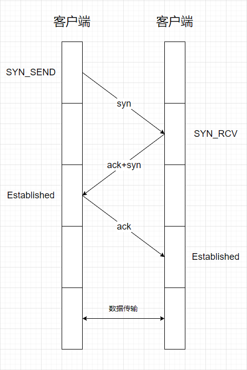

## HTTP

#### TCP三次握手
* 三次握手的流程
  
  开始客户端和服务端都处于CLOSED状态，然后服务端开始监听某个端口，进入LISTEN状态
  - 第一次握手（SYN=1，seq=x），发送完毕后，客户端进入SYN_SEND状态
  - 第二次握手（SYN=1，ACK=1，seq=y，ACKnum=x+1），发送完毕后，服务端进入SYN_RCVD状态。
  - 第三次握手（ACK=1，ACKnum=y+1），发送完毕后，客户端进入ESTABLISHED状态，当服务器接收到这个包时，也进入ESTABLISHED状态，TCP握手，即可以开始数据传输。

* TCP为什么是三次握手
  TCP为什么是三次握手，其实就是在问为什么两次不行，四次又没有必要。
  TCP是可靠传输协议，三次握手就是要确定客户端和服务端`发送`和`接收`的能力是没有问题的。两者互相考察对方的`发送`和`接收`能力。
  - 第一次握手，服务端收到数据包，服务端确定了客户端的发送能力。（客户端 ✔发送能力 ×接收能力，服务端 ×发送能力 ×接收能力）
  - 第二次握手，客户端收到数据包，客户端确定了服务端的发送和接收能力。（客户端 ✔发送能力 ×接收能力，服务端 ✔发送能力 ✔接收能力）
  - 第三次握手，服务端收到数据包，服务端确定了客服端的接收能力。（客户端 ✔发送能力 ✔接收能力，服务端 ✔发送能力 ✔接收能力）
  - 如果只用两次握手，客户端已经确定了服务端的`发送`和`接收`能力，但是服务端还没有确定客户端的`接收`能力。
